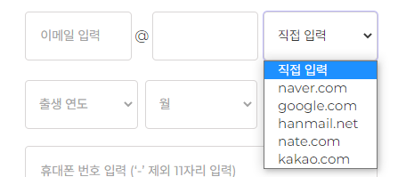
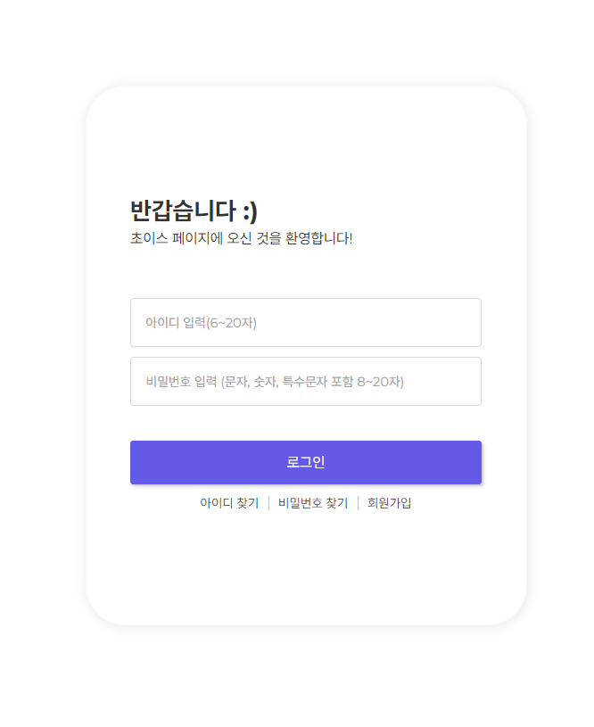
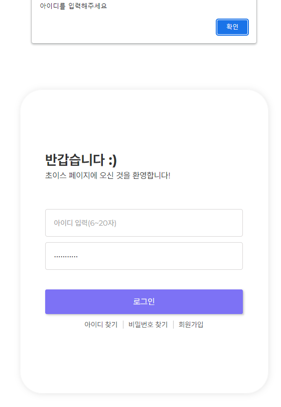
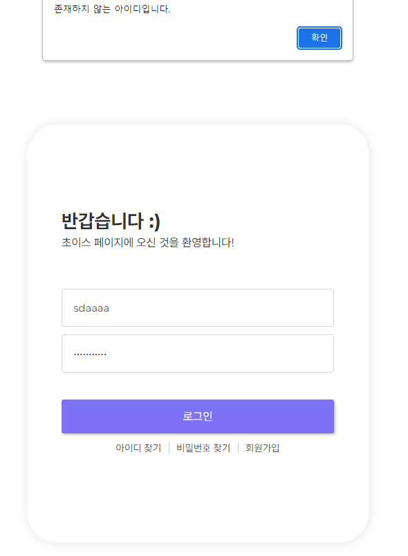

# Sign Up and Sing In

## VanillaJS로 회원가입/로그인 페이지 구현하기 (반응형)

### 관련 포스트

- [회원가입 페이지 구현하기 : input 내부에 버튼, 이메일 도메인 드롭다운](https://choiiis.github.io/web/toy-project-sign-up-and-in-page/)

- [회원가입 페이지 구현하기 : select로 이메일과 생년월일 입력](https://choiiis.github.io/web/toy-project-sign-up-and-in-page-2/)

- [회원가입 페이지 구현하기 : input 유효성 검사와 에러 메세지 출력](https://choiiis.github.io/web/toy-project-sign-up-and-in-page-3/)

### 디자인 시안 및 기획 내용

by choiiis (Figma)

---

## 회원가입 페이지

### 이메일 도메인 select box 구현

### 생년월일 option 동적 생성과 유효성 검사

### 비밀번호 입력과 재입력 일치 여부 확인

### 미입력 및 이상 데이터 확인

- 미입력/이상 데이터 존재 시 상단 필드부터 아래 방향으로 순서대로 에러 메세지 표시

- 모든 데이터 입력 & 유효성 검사 완료 시 (서버 연결 X)

---

## 로그인 페이지

- 아이디 또는 비밀번호 미입력일 경우 alert 출력

- Random값으로 미존재 아이디, 틀린 비밀번호 alert 출력

---

## 결과 페이지

